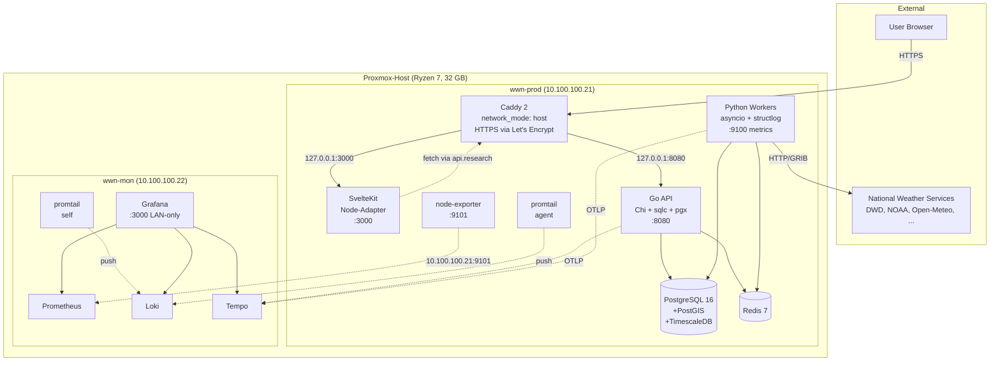

# Architektur

Stand: 2026-05-06. Dieses Dokument beschreibt das Gesamtsystem
worldweathernews.com so, wie es nach Session 11a tatsächlich läuft —
nicht den theoretischen Endzustand. Wenn sich Architektur ändert, wird
diese Datei mitgeführt.

## System-Überblick



## Hosts

Die Plattform läuft in der Forschungs-Phase auf eigener Hardware
(Proxmox VE auf Ryzen 7, 32 GB RAM, Hardware-Firewall davor). Drei VMs:

| VM       | IP             | Rolle                                                         | Größe    |
| -------- | -------------- | ------------------------------------------------------------- | -------- |
| wwn-dev  | 10.100.100.113 | Entwicklung (Editor, mise, Compose-Stack)                     | 8 GB RAM |
| wwn-prod | 10.100.100.21  | App-Stack + Caddy, public via `research.worldweathernews.com` | 8 GB RAM |
| wwn-mon  | 10.100.100.22  | Observability-Stack (Prometheus/Loki/Tempo/Grafana), LAN only | 4 GB RAM |

Die Aufgabentrennung wwn-prod/wwn-mon ist bewusst: bei einem Crash auf
wwn-prod bleibt Telemetrie auf wwn-mon abrufbar, plus die hohe I/O-Last
von Prometheus/Loki konkurriert nicht mit Application-Code.

Migration auf Hetzner Cloud ist als Option im Repo skizziert
(`infra/terraform/modules/server-hetzner/`), aber nicht aktiv.

## Service-Verantwortlichkeiten

### Backend (Go 1.25, Chi)

- HTTP-API für Frontend und potentielle Drittsysteme
- AuthN/AuthZ (Sessions, später API-Keys / OAuth)
- Geschäftslogik (Locations, User-Profile, Alerts, …)
- Caching von hot Read-Pfaden (Redis)
- OpenAPI 3.1 ist Single Source of Truth — Server-Stubs werden via
  oapi-codegen generiert (siehe [ADR-0001](adr/0001-openapi-as-source-of-truth.md))
- **Kein** ETL/Batch — das machen die pyworkers

Health: `/api/v1/ping` (öffentlich, gibt JSON mit Trace-ID).

### Pyworkers (Python 3.12, asyncio)

- Pull externer Wetterdaten (DWD, NOAA, Open-Meteo, später EUMETSAT)
- GRIB-/NetCDF-Parsing (xarray, cfgrib)
- Normalisierung in TimescaleDB-Hypertables
- Periodische Aggregationen (Tages-/Monats-Klima-Stats)
- Sentinel/Heartbeat-Job alle 30 s

Metrics: `:9100/metrics`. Scheduler ist APScheduler 3.x AsyncIOScheduler.

### Frontend (SvelteKit, Node-Adapter)

- SSR für SEO und schnellen First-Paint
- Hydration für Interaktivität (Svelte 5 Runes)
- Karten-Komponente (MapLibre, geplant)
- Personalisierung (Locations, Einheiten, Sprache)
- API-Client unter `apps/frontend/src/lib/api/client.ts`,
  `PUBLIC_API_BASE_URL` ist build-time pinned (siehe Caveat unten)

### Caddy (2-alpine, eigener Compose-Stack)

- Reverse-Proxy für Apex/www/research/api.research
- Auto-TLS via Let's Encrypt (HTTP-01)
- HSTS `max-age=31536000` ohne `includeSubDomains` (bewusst —
  zukünftige interne Subdomains evtl. lange ohne TLS)
- Läuft mit `network_mode: host` für unverfälschte Client-IPs in Logs
- **Nicht** Teil des App-Compose-Stacks — getrennter Lifecycle, eigener
  Deploy-Pfad via `infra/deploy/deploy-caddy.sh`

## Datenflüsse

### Read-Pfad (User schaut Wetter)

```
Browser → Caddy → Frontend (SSR)
                       ↓
                    Hydration
                       ↓
Browser → Caddy → Backend → Redis (cache hit)  oder
                       ↓
                  Postgres (cache miss → set Redis → return)
                       ↓
                  Browser
```

### Write-Pfad (User postet Beobachtung)

```
Browser → Caddy → Frontend → Backend (Auth) → Postgres
```

### Ingest-Pfad (Wetterdaten holen)

```
APScheduler → pyworkers job → External API (HTTP/GRIB)
                                  ↓
                              normalize
                                  ↓
                              Postgres (TimescaleDB Hypertable)
```

## Datenmodell (Skizze)

Konkrete Tabellen kommen mit den ersten Features. Das initiale Modell
sieht so aus:

- `locations` — geographische Orte (UUID, Name, Country, Geo via PostGIS)
- `weather_observations` — TimescaleDB-Hypertable, time-series der
  Beobachtungen pro Location
- `users` — Mitglieder
- `posts` — User-generated Content
- `weather_stations` — citizen-science Stations

Migrations leben in `infra/migrations/` (sprachunabhängig, goose).

## Observability

- **Logs** — strukturiert in JSON: `slog` (Go), `structlog` (Python),
  `pino` (Node, geplant). Promtail liest Container-Logs auf wwn-prod
  und pusht zu Loki auf wwn-mon.
- **Metrics** — Prometheus pull-basiert. node-exporter auf wwn-prod
  ist live; Backend/Pyworkers binden ihre Metrics-Ports aktuell nur
  auf 127.0.0.1 (siehe Caveat).
- **Traces** — OpenTelemetry → OTLP → Tempo. Backend nutzt
  otelchi+otelhttp; Pyworkers das Auto-Instrumentation-Paket. Trace-IDs
  landen in den Logs (Cross-Lookup Loki → Tempo).
- **Dashboards** — drei provisionierte Dashboards in Grafana
  (`Backend Overview`, `Pyworkers Overview`, `Infra Overview`).

Grafana ist auf 0.0.0.0:3000 gebunden und nur aus dem Manager-LAN
(10.100.100.0/24) erreichbar — UFW-Regeln in der `common`-Rolle.

## Caveats und offene Punkte

- **Backend-/Pyworkers-Metrics von wwn-mon aus** sind aktuell nicht
  scrape-bar. Die Metrics-Ports binden 127.0.0.1 only. Entscheidung
  zwischen LAN-Bind+UFW vs. Push-Sidecar (vmagent o. ä.) steht aus.
  Notiert als TODO in `infra/ansible/roles/monitoring-stack/files/prometheus/prometheus.yml`.
- **node-exporter für wwn-mon selbst** läuft nicht im Stack; Host-
  Metriken für wwn-mon sind aktuell blind. Folge-PR.
- **Frontend `PUBLIC_API_BASE_URL` ist build-time** (SvelteKit
  `$env/static/public`). Runtime-ENV in Compose hat **keinen** Effekt.
  Der Wert wird in der Release-Pipeline als `--build-arg` gesetzt
  (`.github/workflows/release.yml`). Wer das Frontend für eine andere
  Umgebung baut, muss den build-arg setzen — sonst landet
  `http://api.localhost` im JS-Bundle.

## Skalierungs-Annahmen

- Single-Host-Deployment ist initial ausreichend
- Horizontale Skalierung (mehrere Backend-Replicas + externer LB) ist
  möglich, aber für die Forschungs-Phase nicht nötig
- TimescaleDB skaliert vertikal weit; Sharding kommt erst bei vielen TB
- Compose → K3s ist der Wachstumspfad, aber bewusst noch nicht
  beschritten ([ADR-0004](adr/0004-compose-before-k3s.md))

## Externe Abhängigkeiten

| Service                     | Zweck                            | Kritikalität     |
| --------------------------- | -------------------------------- | ---------------- |
| Joker.com (Domain + DynDNS) | Domain-Registrar, gate.hw7.eu    | Kritisch         |
| Cloudflare DNS              | DNS Free-Plan, DNS-only Modus    | Kritisch         |
| ProtonMail                  | Mail für `@worldweathernews.com` | Hoch             |
| GitHub                      | Source-Hosting, CI, ghcr.io      | Kritisch         |
| Let's Encrypt               | TLS-Zertifikate via Caddy        | Hoch (ersetzbar) |
| Sigstore                    | Cosign keyless signing           | Mittel           |
| Open-Meteo                  | Wetterdaten Phase 1              | Hoch (ersetzbar) |
| DWD OpenData                | Deutschland-Daten                | Hoch (ersetzbar) |

## Sicherheits-Annahmen

- Hardware-Firewall vor dem Proxmox-Host (NAT 80/443/22 nur auf wwn-prod)
- UFW auf jedem Host: Default-deny inbound, nur whitelisted Ports
- SSH key-only, fail2ban, Hardening via `common`-Rolle
- Container laufen non-root (eigene UIDs pro Service)
- Secrets ausschließlich SOPS-encrypted in Git
- Signierte Commits Pflicht auf `main`

Details: [`docs/secrets.md`](secrets.md), [`docs/runbook.md`](runbook.md).
