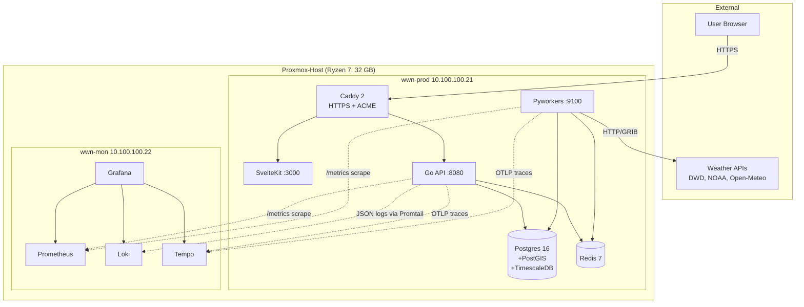
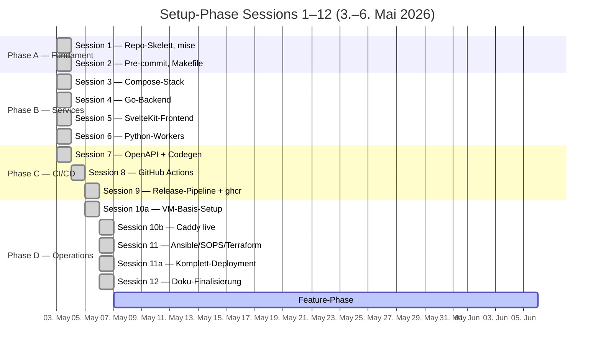
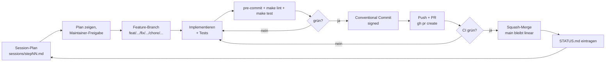
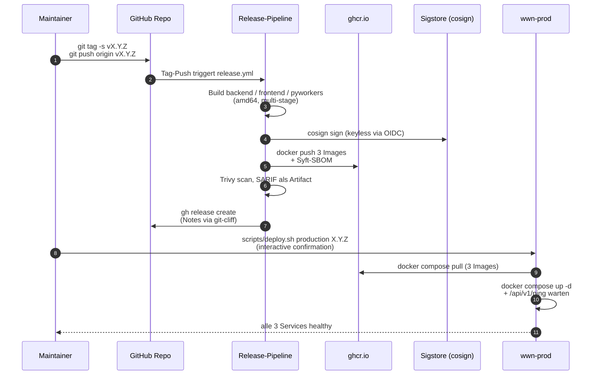
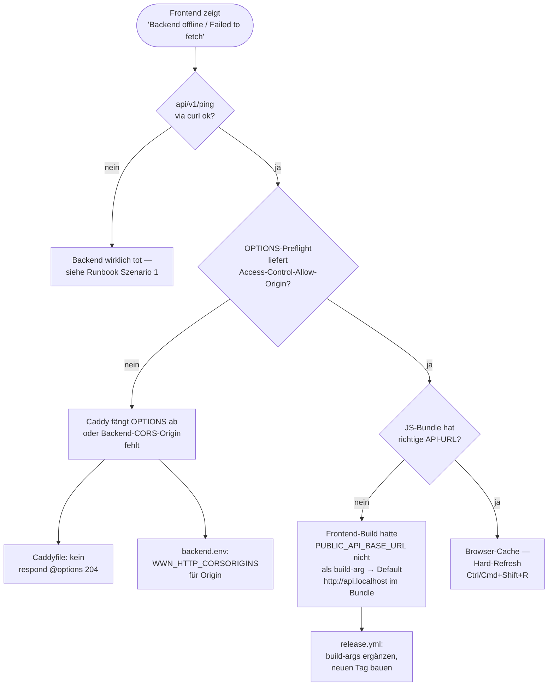
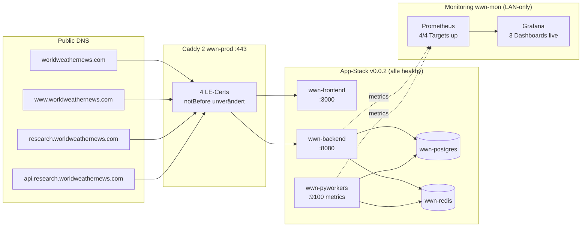
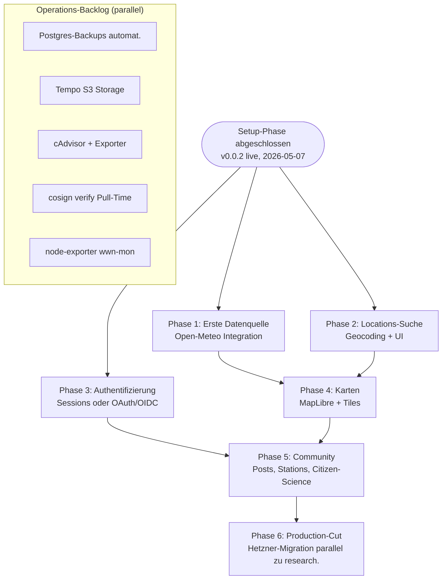

# Präsentation — worldweathernews.com Setup-Phase

Agenda + Stichpunkte für eine Präsentation über Ziele, Vorgehen, Schritte
und aufgefallene Probleme. Stand 2026-05-07. Detaillierte Materialsammlung
pro Session: [`work-done.md`](work-done.md).

---

## Agenda

1. Projekt-Vision und Zielsetzung
2. Architektur-Identität in fünf Worten
3. Vorgehensweise — Session-basierte Entwicklung in 12 Schritten
4. Tech-Stack-Auswahl und Begründungen
5. Phase A — Fundament (Sessions 1–2)
6. Phase B — Services (Sessions 3–6)
7. Phase C — CI/CD und Releases (Sessions 7–9)
8. Phase D — Operations und Live-Betrieb (Sessions 10–12)
9. Aufgefallene Probleme und Lessons Learned
10. Aktueller Stand und Live-Demo
11. Roadmap — Feature-Phase
12. Q & A

---

## 1. Projekt-Vision und Zielsetzung

- **Was wir bauen:** Globale Wetter- und Klimaplattform mit Community-
  Features. Aggregiert Daten nationaler Wetterdienste (DWD, NOAA, JMA,
  Met Office, Open-Meteo), visualisiert Anomalien und Trends, verbindet
  Beobachter und Citizen Scientists.
- **Wer es baut:** Diplom-Meteorologe und IT-Architekt in Personalunion,
  alleinige Entscheidungsgewalt, eigene Hosting-Infrastruktur.
- **Warum self-hosted:** Kostenkontrolle, volle Hardware-Kontrolle,
  DSGVO-Klarheit, Lerneffekt — und 1000 Mbit Anschluss reichen für
  Forschungs-Phase.
- **Forschungs-Phase ≠ echte Production:** Keine SLA, kein Failover,
  kein DDoS-Schutz. Nutzer werden via Banner explizit informiert.
  Migration zu Hetzner Cloud als Option dokumentiert.

## 2. Architektur-Identität in fünf Worten

- **Self-hosted** — Proxmox auf Ryzen 7, 32 GB, drei VMs (dev/prod/mon)
- **Type-safe** — Go + sqlc + pgx, TypeScript + svelte-check, Python + mypy strict
- **Single-Source** — OpenAPI 3.1 als SoT für API-Schema; daraus Server-
  Stubs (Go) und Client-Types (TS) generiert
- **Observability-ready** — Logs (Loki), Metrics (Prometheus), Traces
  (Tempo), eine UI (Grafana) — von Tag 1 mitgedacht
- **Kein Lock-in** — Alles, was wir nutzen, ist self-hostbar oder leicht
  ersetzbar. Cloud-Lock-in-Services im kritischen Pfad sind verboten.

### System-Überblick (Live-Topologie)

### Phasen-Timeline

## 3. Vorgehensweise — Session-basierte Entwicklung in 12 Schritten

- **Diszipliniertes Skelett-vor-Features:** Fundament zuerst, danach
  bauen — keine Features in einem ungesicherten Repo.
- **Plan vor Ausführung:** Jede Session hat eine eigene
  `sessions/stepNN.md` mit Mission, Aufgaben, Erfolgs-Kriterien und
  Stolperstein-Erwartungen.
- **Trunk-based Development:** Kurze Feature-Branches, Squash-Merge in
  `main`, Branch-Protection mit grüner CI als Gate, signierte Commits Pflicht.
- **Conventional Commits:** `feat(scope)`, `fix(scope)`, `docs`, `chore`,
  `ci`, `refactor` — von commitlint im CI erzwungen.
- **Automatisierung wo möglich, Pragmatismus wo nötig:** mise für
  Toolchain, pre-commit für Hygiene, GitHub Actions für CI, Ansible
  für Server, SOPS für Secrets, Terraform für VMs.
- **Ehrliche Dokumentation:** Jeder Stolperstein wandert in CLAUDE.md
  „Häufige Fallen" und/oder docs/runbook.md. Keine kosmetische Doku.

## 4. Tech-Stack-Auswahl und Begründungen

- **Backend Go statt Node/Python/Rust** — distroless-26-MB-Binary,
  Goroutines für viele externe API-Calls, sqlc+pgx für typsichere
  Queries ohne ORM (ADR-0002).
- **Monorepo statt Multi-Repo** — atomare Cross-Service-Änderungen,
  eine CI-Surface, Codegen lebt neben Schema (ADR-0003).
- **Compose statt K3s** — Solo-Maintainer, single-host, kein Rolling-
  Update-Need. K3s-Migrationspfad bleibt offen (ADR-0004).
- **SOPS+age statt Vault** — keine zusätzliche Service-Komplexität,
  Audit per Git-History, age einfacher als GPG (ADR-0005).
- **OpenAPI als SoT** — Server-Client-Drift ausgeschlossen, API-Doku
  immer aktuell, externer Konsum trivial (ADR-0001).
- **TimescaleDB-HA-Image** — bringt PostGIS und TimescaleDB in einem
  Container — Geo + Zeitreihen out-of-the-box.

## 5. Phase A — Fundament (Sessions 1–2)

- **Session 1** — Repo-Skelett, mise mit gepinnten Versionen für Go,
  Node, Python, pnpm, uv, golangci-lint, sqlc, goose. Top-Level-Makefile
  als einheitliches Interface.
- **Session 2** — Pre-commit-Hooks, lokale Workflows, prettier/ruff/
  golangci-lint-Integration. Sprach-Tools als `repo: local`-Hooks
  (statt `additional_dependencies`), damit Workspace und Hook nicht
  zwei Versionen pflegen müssen.
- **Take-away:** Ein Befehl (`mise install`), drei Sprachen, ein
  reproduzierbarer Stand auf jeder neuen Maschine.

## 6. Phase B — Services (Sessions 3–6)

- **Session 3** — Compose-Stack mit Postgres+TimescaleDB+PostGIS, Redis,
  Caddy, Mailhog. `.localhost`-Hostnames für saubere TLS-Tests in dev.
- **Session 4** — Go-Backend-Skelett. Chi-Router, sqlc-Queries,
  Viper-Config mit `WWN_`-Prefix, slog JSON, distroless-Final-Image
  26 MB.
- **Session 5** — SvelteKit-Frontend, Svelte 5 Runes, Tailwind v3,
  shadcn-svelte. Production-Image bleibt non-root.
- **Session 6** — Python-Workers, asyncio + asyncpg, APScheduler 3.x,
  Heartbeat alle 30 s, Metrics-Endpoint auf :9100.

### Vorgehens-Loop pro Session

## 7. Phase C — CI/CD und Releases (Sessions 7–9)

- **Session 7** — OpenAPI 3.1 als SoT, oapi-codegen v2.4.1,
  openapi-typescript 7.10. `make gen` regeneriert beide Outputs;
  `scripts/check-generated.sh` blockt CI bei Drift.
- **Session 8** — GitHub Actions Workflows pro Service (`ci-backend`,
  `ci-frontend`, `ci-pyworkers`), commitlint, Markdown-Link-Check,
  YAML-Lint, OpenAPI-Lint, Generated-Files-Check.
- **Session 9** — Tag-getriggerte Release-Pipeline für alle drei
  Services. Cosign keyless via Sigstore, Syft-SBOM, Trivy-Scan,
  git-cliff für Release-Notes. ~3 Min pro Release-Run.

### Release- und Deploy-Flow

## 8. Phase D — Operations und Live-Betrieb (Sessions 10–12)

- **Session 10a** — wwn-prod und wwn-mon Basis-Setup. Ubuntu 24.04 LTS,
  SSH-Hardening, ufw, fail2ban, chrony, Docker, sops/age. Drei VMs auf
  Proxmox mit MAC-basierten DHCP-Reservations (Konvention: letzte
  Bytes spiegeln IP-Suffix, z.B. `bc:24:11:00:21:21` für `.21`).
- **Session 10b** — Caddy live auf wwn-prod als eigenständiger Stack
  unter `/srv/wwn/caddy` mit `network_mode: host`. Vier Let's-Encrypt-
  Zertifikate ausgestellt (Apex/www/research/api.research). HSTS
  bewusst **ohne** `includeSubDomains` (zukünftige interne Subdomains
  evtl. lange ohne TLS).
- **Session 11** — Ansible + SOPS + Terraform-Skelett. Vier Rollen
  (`common`/`docker`/`app`/`monitoring-agent`), drei Playbooks
  (`site`/`deploy`/`rollback`), `bpg/proxmox`-Provider aktiv.
- **Session 11a** — Komplettes Deployment beider VMs. Bind-Mount-
  Migration der Caddy-Certs, Monitoring-Stack-Rolle für wwn-mon,
  App-Stack-Deploy. Versionssprung von rc1 → rc2 → rc3 → rc4 → 0.0.2
  am selben Tag durch Diagnose-Patches (siehe Probleme).
- **Session 12** — Doku-Finalisierung. README-Polish, CONTRIBUTING,
  architecture/development/deployment/runbook, ADRs 0002–0005,
  AGPL-3.0 LICENSE, docs/backlog.md als Folge-Tracker.

## 9. Aufgefallene Probleme und Lessons Learned

Stolperstein-Highlights — alle dokumentiert in CLAUDE.md → Häufige
Fallen und docs/runbook.md.

### Toolchain-Drift

- **Symptom:** CI-Failure, generated-Files mismatch, Go-Toolchain-
  Auto-Bump.
- **Root cause:** Vier Quellen (go.mod, .mise.toml, ci-\*.yml, Dockerfile)
  müssen dieselbe Major.Minor zeigen.
- **Lesson:** Goldene Regel — Versions-Pin-Konsistenz vor jedem Commit.
- **Beispiel:** pgx v5.9.2 verlangte Go 1.25 — die ganze Toolchain
  musste mitgezogen werden.

### Single-File-Bind-Mount-Inode-Falle

- **Symptom:** Nach `rsync` einer neuen Caddyfile auf wwn-prod sah der
  Container weiterhin die alte Config — auch nach `docker compose up -d`
  und `caddy reload`.
- **Root cause:** rsync macht atomic-rename → neuer Inode. Container-
  Bind-Mount hängt am Original-Inode beim Start.
- **Fix:** `docker compose restart caddy` nach `rsync`. Volume-Bind-
  Mounts (Verzeichnisse) sind davon nicht betroffen.
- **Lesson:** Gleiche Falle bei monitoring-stack-Configs. Ansible-
  Handler `Restart monitoring stack` triggert auf Config-File-Changes.

### SvelteKit `PUBLIC_*` ist Build-Time, nicht Runtime

- **Symptom:** Frontend zeigt „Backend offline / Failed to fetch", obwohl
  Backend gesund ist und CORS korrekt.
- **Root cause:** `$env/static/public` wird zur **Build-Zeit** ins JS-
  Bundle gebacken. Runtime-ENV in Compose hat keinen Effekt. Release-
  Pipeline gab den build-arg nicht mit.
- **Fix:** `PUBLIC_API_BASE_URL` als `--build-arg` in
  `.github/workflows/release.yml`. Frontend-Image mit dem korrekten Wert
  neu gebaut und als v0.0.2 published.

### Diagnose-Pattern „Backend offline / Failed to fetch"

### CORS-Preflight via Caddy vs. chi-cors

- **Symptom:** Browser blockiert Cross-Origin-Anfragen vom Apex zur
  api.research, obwohl `WWN_HTTP_CORSORIGINS` korrekt gesetzt ist.
- **Root cause:** Caddyfile fing OPTIONS-Preflights mit bare 204 ab.
  Backend-chi-cors kam nie zum Zug, kein `Access-Control-Allow-Origin`-
  Header in der Antwort.
- **Fix:** OPTIONS-Short-Circuit aus dem Caddyfile entfernt — chi-cors
  übernimmt Preflights mit den korrekten Headern.

### GHCR-PAT-Scopes (Fine-grained vs Classic)

- **Symptom:** `docker pull ghcr.io/relations4u/wwn-backend:0.0.2` →
  HTTP 403 "permission_denied: token does not match expected scopes".
- **Root cause:** Fine-grained PAT hatte `Packages: Read` nicht unter
  Organization-Permissions. Repository-Permissions haben überhaupt keinen
  Packages-Scope.
- **Fix:** Classic-PAT mit `read:packages`. Fine-grained-Setup für
  Multi-Maintainer dokumentiert.

### Frontend-Healthcheck IPv4/IPv6

- **Symptom:** Frontend-Container permanent `unhealthy`, Caddy
  reverse_proxy aber funktioniert.
- **Root cause:** busybox-wget resolved `localhost` zu `::1` (IPv6).
  SvelteKit-Server bindet nur IPv4 (`HOST=0.0.0.0`).
- **Fix:** Healthcheck-CMD von `localhost` auf `127.0.0.1`.

### UFW-Regeln vs. Docker-iptables

- **Symptom:** Prometheus-Scrape von wwn-mon → 10.100.100.21:9101 läuft
  ins Timeout, obwohl node-exporter listet.
- **Root cause:** UFW-Default-deny blockiert die Scrape-Ports im LAN.
- **Fix:** Neue `monitoring_scrape_ports`-Liste in der `common`-Rolle,
  öffnet 9090/9100/9101/3000 und später 8080 nur aus
  `10.100.100.0/24`.

### `sudo` über plain SSH ohne TTY

- **Symptom:** Deploy-Skript scheitert mit „sudo: a terminal is required".
- **Root cause:** `BatchMode=yes` plus `sudo install …` braucht TTY.
- **Fix:** Skripte prüfen Vorbedingungen mit `test -d` statt `sudo install`.
  Erstmalige Verzeichnis-Anlage einmalig manuell mit `ssh -t`.

### Heredoc-in-zsh und commitlint body-max-line-length

- **Symptom 1:** `git commit -m "$(cat <<EOF…)"` mit 100+ Zeichen pro
  Body-Zeile → commitlint fail.
- **Symptom 2:** Heredoc mit `  EOF` (Leading-Whitespace) hängt zsh.
- **Fix:** `git commit -F /tmp/msg.txt` mit manueller ≤95-Wrap.
  `gh pr create --body-file /tmp/body.md` statt Heredoc.

### Sonstiges

- Cosign verify zur Pull-Time auf wwn-prod ist offen — Pipeline signiert,
  Server zieht ohne Verifikation. Backlog-Item.
- Default-Versionen in `group_vars/all.yml` sind `0.0.0` — bewusster
  Fail-fast-Marker, damit niemand „aus Versehen" einen Container ohne
  expliziten `target_version`-Override hochfährt.

## 10. Aktueller Stand und Live-Demo

### Effizienz-Vergleich — mit KI vs. ohne KI

| Phase                       | Mit KI (Sessions) | Ohne KI (Solo-Senior-Schätzung) | Faktor     |
| --------------------------- | ----------------- | ------------------------------- | ---------- |
| A — Fundament (S 1–2)       | ~0,5 Tage         | 3–5 Tage                        | ~6–10×     |
| B — Services (S 3–6)        | ~1 Tag            | 12–18 Tage                      | ~12–18×    |
| C — CI/CD + Release (S 7–9) | ~1 Tag            | 8–12 Tage                       | ~8–12×     |
| D — Operations (S 10–12)    | ~2,5 Tage         | 18–25 Tage                      | ~7–10×     |
| **Gesamt**                  | **~5 Tage**       | **~40–60 Tage**                 | **~8–12×** |

Annahmen: Solo-Senior-Developer, der alle Architektur-Entscheidungen
selbst trifft, alle Stolpersteine sequenziell entdeckt (statt parallel
zur Diagnose) und sich bei unbekannten Tools (bpg/proxmox, cosign-
keyless, sqlc, oapi-codegen 3.1, SOPS+age, Caddy `network_mode: host`)
durch die jeweiligen Docs liest. KI-Stunden enthalten **nicht** den
Maintainer-Aufwand für Verifikation, manuelle Server-Schritte
(Snapshots, sudo-TTY-Sessions, Cloudflare-DNS), Cross-Reading der
generierten Doku und die Architektur-Hoheit — die bleiben Mensch.

### Live-Stand

- **Live unter <https://research.worldweathernews.com>** (Frontend) und
  <https://api.research.worldweathernews.com/api/v1/ping> (Backend).
- **v0.0.2 in Production:** alle drei Services healthy, alle vier
  LE-Zertifikate seit Cutover unverändert.
- **Monitoring vollständig:** Prometheus scraped backend, pyworkers,
  node-exporter (wwn-prod), prometheus selbst. Grafana-Dashboards mit
  echten Daten — Request-Rate, Latency p50/p95/p99, Heartbeat-Counter,
  CPU/Memory.
- **Snapshots:** Proxmox-Snapshots `caddy-online` und `setup-complete`
  als Rollback-Anker.
- **Demo-Möglichkeiten:**
  - Live-Curl zum API-Endpoint, Trace-ID im Browser
  - Grafana-Tunnel `ssh -L 3000:127.0.0.1:3000 hwr@10.100.100.22`,
    Backend-Dashboard live
  - `gh release view v0.0.2` zeigt SBOM-Asset, cosign-Signatur,
    automatisch generierte Notes

### Live-State-Snapshot

## 11. Roadmap — Feature-Phase

- **Erste Datenquelle:** Open-Meteo (EU, ohne API-Key) als Phase-1-Wahl.
- **Locations-Suche:** Geocoding, DB-Schema (`locations` + PostGIS),
  Endpoint, UI mit Autocomplete.
- **Authentifizierung:** Sessions oder OAuth/OIDC — Entscheidung in der
  ersten Auth-Session.
- **Karten-Komponente:** MapLibre, Tile-Server-Auswahl.
- **i18n-Library:** svelte-i18n vs. Paraglide vs. Inlang —
  Entscheidung wenn die ersten User-facing Strings kommen.
- **Externe Datenquellen Phase 2:** DWD, NOAA, EUMETSAT, USGS,
  NOAA Space Weather.
- **Operations-Backlog:** automatisierte Postgres-Backups, Tempo-S3-
  Storage, cAdvisor + postgres_exporter + redis_exporter, cosign-
  Verify zur Pull-Time, Mailpit statt Mailhog (siehe `docs/backlog.md`).
- **Production-Migration:** echter Production-Stack auf Hetzner
  parallel zu `research.` — Ansible/Terraform funktionieren bereits
  gegen beide.

### Roadmap-Übersicht

## 12. Q & A

Vorbereitete Antworten auf wahrscheinliche Fragen:

- **Warum kein Kubernetes?** ADR-0004 — Solo-Maintainer, Single-Host,
  kein Rolling-Update-Need. Wachstumspfad zu K3s ist offen, aber nicht
  jetzt.
- **Wie sicher ist die Plattform?** Self-hosted, UFW + fail2ban,
  signed commits, cosign-Signaturen für Images, SOPS-encrypted Secrets.
  Aber: Forschungs-Phase, keine SLA, keine SOC-2-Zertifizierung.
- **Was kostet der Betrieb?** Strom + Internet-Anschluss + Domain
  (Joker.com) + ProtonMail. Keine Cloud-Rechnungen.
- **Wie skaliert das?** Vertikal weit. Horizontal über mehrere Backend-
  Replicas + externer LB möglich, derzeit nicht nötig. TimescaleDB
  skaliert vertikal weit, Sharding erst bei vielen TB.
- **Wer hat den Source?** AGPL-3.0 — Code bleibt offen, Re-Hosters
  müssen Modifikationen veröffentlichen.

---

## Anhang — Querverweise

- Komplette Materialsammlung pro Session: [`work-done.md`](work-done.md)
- Status-Tabelle: [`STATUS.md`](STATUS.md)
- Architektur mit Mermaid-Diagramm: [`../docs/architecture.md`](../docs/architecture.md)
- Runbook (10 Szenarien): [`../docs/runbook.md`](../docs/runbook.md)
- ADRs 0001–0005: [`../docs/adr/`](../docs/adr/)
- Operations-Backlog: [`../docs/backlog.md`](../docs/backlog.md)
- Spielregeln (Versions-Pinning, App-Release-Pinning, Häufige Fallen):
  [`../CLAUDE.md`](../CLAUDE.md)
